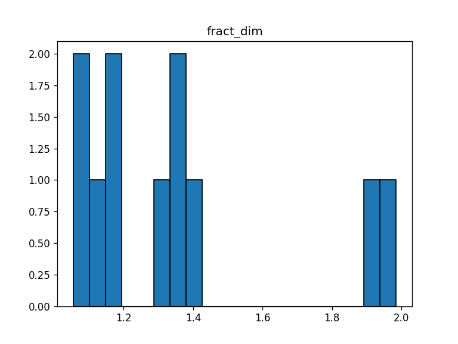
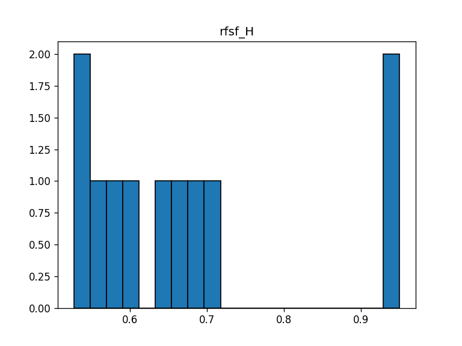
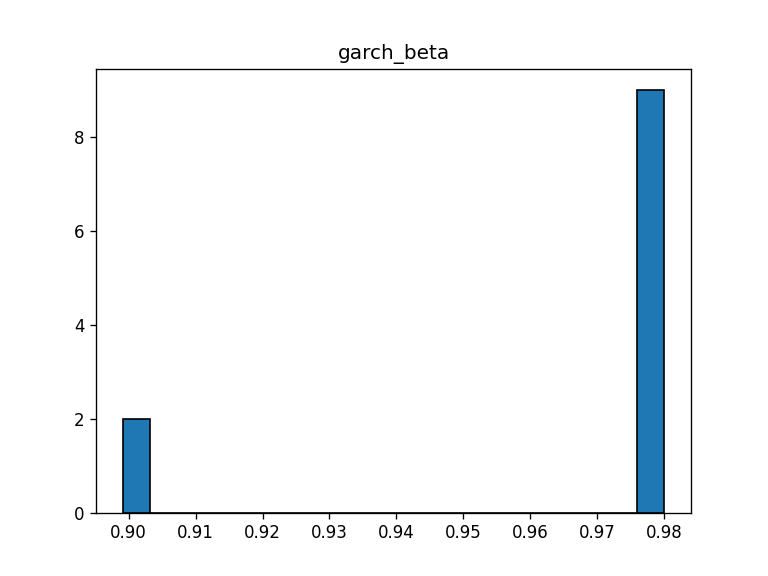

# forecast_vol

Intraday realized-volatility forecasting at the one-minute grid.  
The stack stitches together

* classic econometrics (Student-t EGARCH, RFSV, wavelet fractals)
* cross-asset graph neural nets (rolling correlation GCN)
* a lightweight Transformer forecaster

Everything is YAML-driven and packaged with strict typing, PyPI pinning and a
Makefile for easy incremental runs.

## Introduction

* **Date range** : 2023-01-04  ->  2024-12-31  
* **Universe**   : 11 tickers  
  AAPL, AMZN, GOOGL, META, MSFT, NFLX, NVDA, TSLA, SPY, QQQ, VXX  
* **Benchmarks** : SPY, QQQ, VXX (used for the GNN residual design matrix)  
* **Rows**       : 2 137 111 minute bars  
* **Source**     : Polygon.io free API

### Overview of layers

| layer       | Make target       | key script / entry point             |
| ----------- | ----------------- | ------------------------------------ |
| market      | build-sessions    | market/build_sessions.py             |
| preprocess  | preprocess        | preprocess/\*                        |
| synergy     | synergy           | synergy/\*   (HMM + rolling GCN)     |
| stochastic  | stochastic        | stochastic/\*                        |
| attention   | attention         | attention/\*  (Transformer + HPO)    |

### Repo Layout

```bash
    src/forecast_vol/          importable package
      ├─ market/               NYSE calendar
      ├─ preprocess/           gap-fill, minute features
      ├─ synergy/              HMM regimes + rolling GCN
      ├─ stochastic/           EGARCH, fractal, RFSV
      └─ attention/            Transformer predictor
    configs/                   YAML configs
    tests/                     pytests
    Makefile                   dev shortcuts
    Dockerfile                 slim Python 3.13 base
    data/                      raw, interim, processed, external
    reports/                   all plots and summaries
```

### Quick Start

```bash
    git clone https://github.com/diljit22/forecast_vol.git
    cd forecast_vol

    # editable install + dev tooling
    make dev-install

    # build NYSE calendar once
    make build-sessions

    # full end-to-end pipeline (CPU)
    make pipeline

    # run tests
    make test
```

The default configuration is CPU-only. GPU users can point configs/*.yaml
to a cuda device and install the matching wheels.

### Dockerimage

```bash
    docker build -t forecast_vol .
    docker run --rm -v "$PWD/data:/app/data" forecast_vol make pipeline
```

Note: for Cuda the appropriate wheels should be added.

## Data

### Retrieval, Naming, Raw Schema

CSV bars were downloaded from the Polygon.io minute endpoint (free tier).

Minute files **must** be named `<TICKER>_1m.csv`.  
If your feed differs, tweak the loader in `preprocess/restrict.py`. As it crawls
for files of named in this format:

```bash
    data/raw/
    └── 2023/
        ├── stock/   AAPL_1m.csv  MSFT_1m.csv  ... 8 total
        └── etf/     SPY_1m.csv   QQQ_1m.csv   VXX_1m.csv
    └── 2024/
        ├── stock/   AAPL_1m.csv  MSFT_1m.csv  ... 8 total
        └── etf/     SPY_1m.csv   QQQ_1m.csv   VXX_1m.csv
```

Raw Schema for the ticker data follows this format (for each minute)

| column         | dtype   | comment                  |
| -------------- | ------- | ------------------------ |
| t              | int64   | Unix epoch (ms, UTC)     |
| datetime       | str     | UTC                      |
| open           | float32 |                          |
| high           | float32 |                          |
| low            | float32 |                          |
| close          | float32 |                          |
| volume         | float32 | raw shares               |
| vwap           | float32 |                          |
| trades_count   | int32   |                          |

Market calander data was collected from the NYSE calendar and compiled in a JSON.
This is later parsed into Unix epoch ms.

### Active Sessions and Preprocessing

`market/build_sessions.py` builds an NYSE calendar JSON with epoch-ms open/close
pairs (09:30 to 16:00 or 09:30 to 13:00 on half-days). It is called by `make build-sessions`
Run once:

Data is cleaned via `make restrict` and `make resample`. The former trims raw
CSV to the trading grid and audits gaps while the latter fills missing minutes, synthesizes High/Low with a small epsilon wiggle and recomputes VWAP.

For each row ticker and each row the following basic features are added via the
`make build-dataset` pipeline:

```bash
- add_active_neighbourhood : prev/next trading-day flags
- add_distance_open_close  : millis since open / until close
- add_simple_returns       : close-to-close percent return
- add_log_return           : log return of close price
- add_parkinson            : Parkinson high-low volatility
- add_realised_var         : rolling realised variance
- add_bipower              : bipower variation estimator
- add_garman               : Garman-Klass volatility
- add_iqv                  : integrated quartic variation
- add_trade_intensity      : first-difference volume proxy
- add_vov                  : volatility-of-volatility
- one hot encoding for ticker symbols
```

All tickers are also merged into one parquet in this step.

## Cross-asset synergy and Stochastic Layers

### Gaussian HMM `make hmm`

Labels each ticker into three volatility regimes:

| ticker | low-vol (0) | medium (1) | high (2) |
|:------:|-----------:|-----------:|---------:|
| AAPL   |  97 216 |  97 219 | **20** |
| AMZN   |  97 195 |  97 205 | **55** |
| GOOGL  |  97 183 |  97 197 | **75** |
| META   |  97 204 |  97 211 | **40** |
| MSFT   |  97 213 |  97 217 | **25** |
| NFLX   |  96 829 |  96 835 | **55** |
| NVDA   |  97 166 |  97 184 | **105** |
| QQQ    |  97 225 | **97 225** |  5 |
| SPY    | **97 223** | **97 223** |  5 |
| TSLA   |  97 099 |  97 141 | **215** |
| VXX    |  228    |  162    | **192 911** |

* Numbers are minute bars inside each regime

### GNN correlation model `make gnn` + `make gnn-snapshots`

* design matrix = minute returns minus benchmark residuals
* Optuna tunes (edges >= |thr|, hidden_dim, layers, lr)  
* best model: `thr=0.493`,  hidden=128,  layers=3,  lr=5.7e-4  
* rolling daily embeddings written to *data/interim/synergy_daily/*

GNN correlation model Optuna sweep (top 5)

| rank | thr  | hidden | layers  | lr      | loss |
|:---:|:------:|:-----:|:------:|:--------:|------:|
| 1   | 0.493  | 128   | 3      | 5.7 e-4  | 0.0869 |
| 2   | 0.470  | 128   | 2      | 7.23 e-4 | 0.1514 |
| 3   | 0.478  | 128   | 2      | 5.99 e-4 | 0.1543 |
| 4   | 0.405  | 128   | 3      | 7.49 e-4 | 0.2373 |
| 5   | 0.384  | 64    | 4      | 1.64 e-3 | 0.1962 |

The best trial (**row 1**) is automatically written to
`data/interim/synergy_daily/` and its hyper-parameters are written to
`reports/synergy/best_params.yaml`.

*(Full 20-trial CSV lives in `reports/synergy/optuna.csv`.

### Stochastic layer   `make stochastic`

This stage adds three per-ticker volatility features to complement minute-level data:

| method                     | intuition / what it measures | code (entry-point)       |
| -------------------------- | ---------------------------- | ------------------------ |
| Wavelet fractal dimension  | roughness of the log-RV path | `stochastic/fractal.py`  |
| Student-t EGARCH(1,1)      | volatility persistence       | `stochastic/egarch.py`   |
| RFSV MLE                   | Hurst-like roughness + scale | `stochastic/rfsv.py`     |

|                 | fract dim  | RFSV: H    | EGARCH      |
| --------------- | ----------:| ----------:| -----------:|
| mean            | 1.36       | 0.67       | 0.965       |
| std             | 0.31       | 0.15       | 0.033       |
| min, max        | 1.05, 1.98 | 0.53, 0.95 | 0.90, 0.98  |





Artifacts live in `data/interim/stochastic.parquet`  
and a full CSV report is written to `reports/stochastic/fit_report.csv`.

## Transformer layer: minute-ahead RV forecast  `make attention`

Optuna-selected hyper-parameters

| hyper-parameter | best value |
| --------------- | ---------- |
| `d_model`       | 32 |
| `ff_dim`        | 128 |
| `num_layers`    | 2 |
| `num_heads`     | 2 |
| `dropout`       | 0.20 |
| `lr`            | 2.34 * 10**(-4) |
| `epochs`        | 4 |

Chronological CV, 2023-01-04 -> 2024-12-31 (11 tickers)

| split | MSE        | RMSE |
| ----- | ---------- | ---- |
| train | 1.03 * 10**(-4) | 0.010 |
| val   | 1.02 * 10**(-4) | 0.010 |
| test  | 8.69 * 10**(-5) | 0.009 |

95% of absolute errors fall inside +- 0.002 realized-variance units. However this is probably due to the scale of data (minute var is inherently low and despite normalization techniques I could not discern it fully)

## Unit tests

```bash
    make test
```

Coverage:

* calendar logic
* feature-engineering pipe
* correlation matrix + GNN forward
* EGARCH / RFSV return finite values
* Transformer Predictor shape check

## License

MIT license - see `LICENSE`.

```bash
    @software{singh2025_forecastvol,
      author = {Diljit Singh},
      title  = {forecast_vol: Minute-level volatility forecasting},
      year   = 2025,
      url    = {https://github.com/diljit22/forecast_vol}
    }
```
